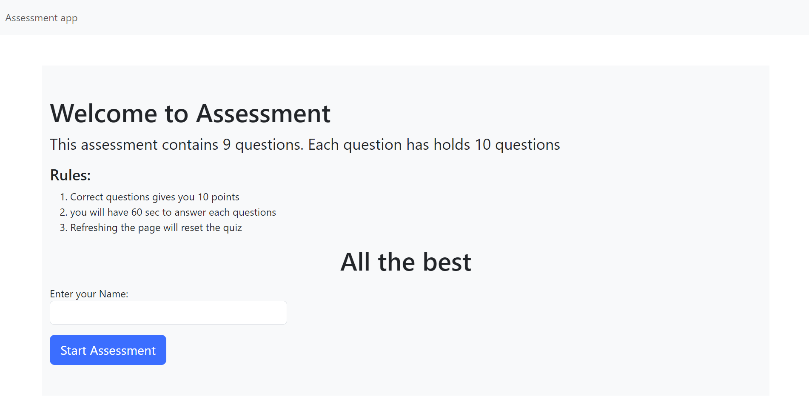
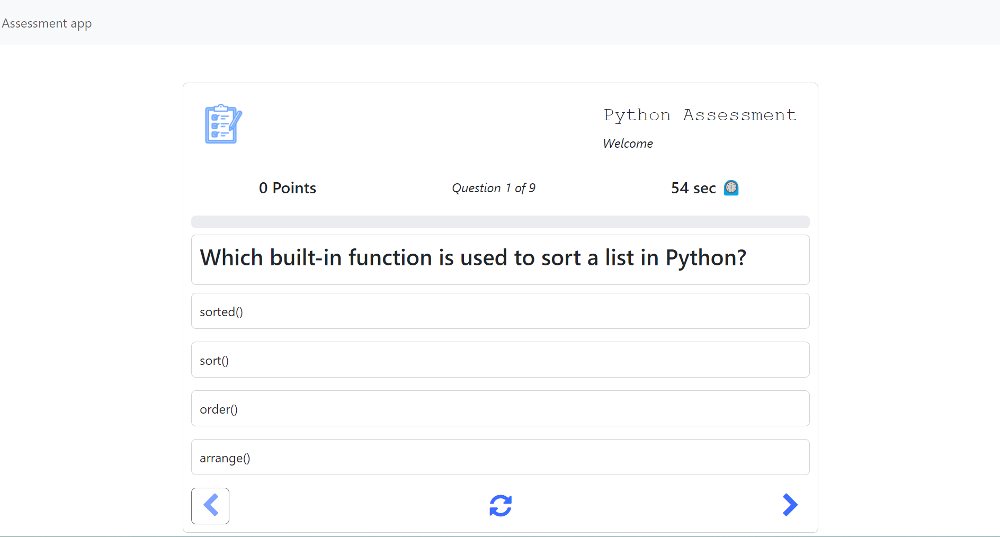

# E-Learning Application Setup Guide

Welcome to the E-Learning application! This platform enables learners to take assessments on various courses and sends their grade data to PostgreSQL. The frontend is built with Angular, the backend with Node.js and Express.js, and the database uses PostgreSQL. The application is hosted on Google Cloud Platform (GCP).

## Getting Started

Follow these steps to run the E-Learning application on your local machine:

### 1. Clone the Repository

Clone the repository to your local machine using Git:

```bash
git clone <repository_url>
```

### 2. Install Dependencies on Client-side

Navigate to the project's root directory in your terminal and install the required dependencies using npm:

```bash
cd assessmentApp
npm install
```
### 3. Install Dependencies on Server-side

Navigate to the project's root directory in your terminal and install the required dependencies using npm:

```bash
cd Server
npm install
```

### 4. Start the Backend Server

Navigate to the server directory using the following commands:

```bash
cd Server
cd src
```

Start the backend server on port 3000 with the following command:

```bash
node server.js
```

The backend server should now be running locally at `http://localhost:3000`.

### 5. Launch the Application

Open your web browser and go to `http://localhost:3000` to verify that the backend server is working correctly.

### 6. Explore the Application

Once the application is running, you can explore its features, including taking assessments and viewing your grades.

## Application Components

- Frontend: Angular
- Backend: Node.js, Express.js
- Database: PostgreSQL
- Hosting: Google Cloud Platform (GCP)

## Screenshots

Here are some screenshots of the E-Learning application:




## Additional Notes

- The application is hosted on Google Cloud Platform (GCP) at the following URL: https://amesite-assessment-rutuja.uc.r.appspot.com
- Make sure to have Node.js and npm installed on your machine before starting the application setup.

Feel free to reach out to me @rutuja.dukhande7@gmail.com for any assistance or questions related to the setup and usage of the E-Learning application.
